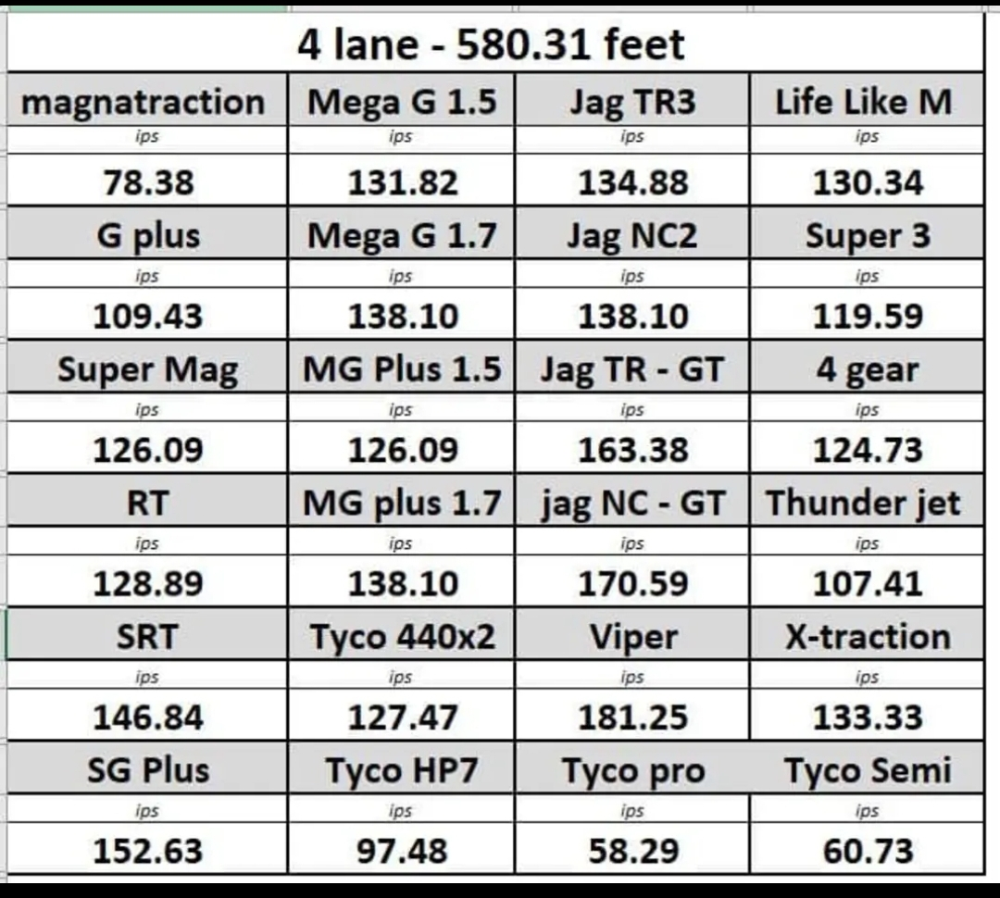
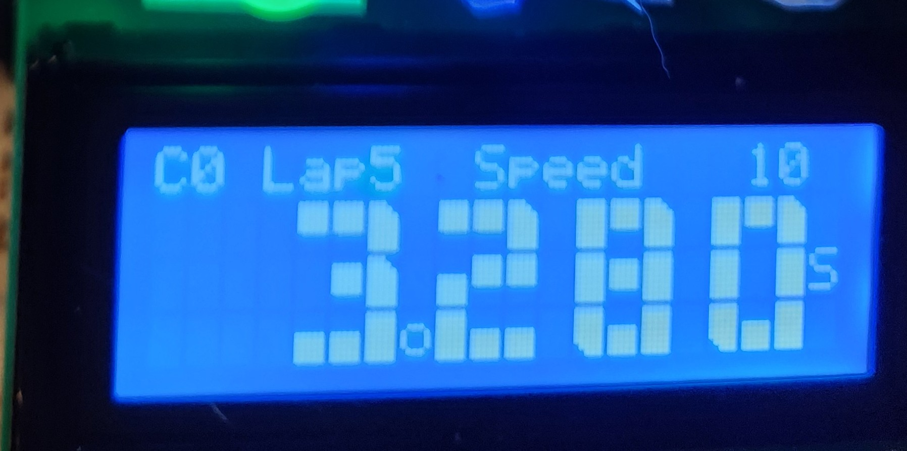

# VroomRacer
Vroom Racer is a simple Arduino Lap Timer for slot car racing using photoresistor photo eyes.

# Arduino-Based Slot Car Tracker and Timer

## Project Goals
The aim of this project is to create an Arduino-based slot car tracker and timer that provides reliable counting and timing in a compact form. Using a laptop is impractical due to space constraints and the inconvenience of using Windows. By coding my own solution, I can tailor it to my specific needs.

## Race Control Lights


There is a RGB led flag light, that can emit different colors.
- **Red**: Your car should be stopped. Laps are not counted.
- **Yellow**: Your car should go at half speed through the lap sensor.
- **Green**: The race is on!
- **Cyan**: there is a winner.


## Lap Timing and Speed Calculation
- **Lap Duration**: Measured from start to start with time in milliseconds.
- **Trap Speed**: Calculated based on the time the car breaks the beam. The car length is assumed to be 2.5 inches, and this is internally calculated as a count of interrupt "clicks" and given in inches per second.

**Inches per Second is the Best Speed Measurement for Slot Cars**

Using inches per second (in/s) to measure slot car speed is practical and relatable. Here’s why:

1. **No Scale Confusion**: Avoids debates over different scale speeds.
2. **Real Car Comparison**: Similar to mph for real cars. For example, a fast slot car goes 8.5 feet per second, which is 5.8 mph or 102 inches per second. 102 sounds like a 1:1 car speed.
3. **Track Compatibility**: Our tracks (e.g. 6, 9, 18 inches) align perfectly with this measurement.
4. **Consistency**: Ensures uniformity across different tracks and setups.

By using inches per second, we simplify speed measurement and enhance our racing experience. 




## Real-Time Calculations
- **Average lap duration**: this is used to detect yellow or red flags
- **Average start/finish trap speed**: this is used to determine if a yellow flag speed limit violation occurs. Speed trap time is mostly resilient to outliers.
- **Impossibly fast laps** There is a debounce timeout that if the detection is within then the detection is completely ignored.
- **Automatic Jumped Lanes Detection** Doesn't rely on the average lap duration but instead uses the best lap duration for effectiveness. The track has a preset minimum lap time based on the fastest magnet car, which is hardcoded. This method is a baseline and somewhat protects the first lap. But for subsequent laps, especially for slower cars, a more accurate approach. After the first lap, if a car attempts to complete a lap in less than 60% of its fastest lap time, that lap is rejected. This way, if a car jumps a lane and tries to record a lap time that's half of its usual duration, the lap is discarded. It is recommended that if the first lap is crashed, the people running the race should be restarted.


*Car 0 on Lap 5 went through the photo eye at 10 inches per second and made a lap time of 3.280 seconds.*

## Automatic Yellow Flags
- If a driver hasn't completed a lap after 1.5 times their average lap time a yellow light goes on.
- Drivers must pass thru the sensor at a slower speed for the lap to count. Speeding the sensor results in that specific lap being ignored.

A competition yellow is thrown halfway through the race.

## Automatic Red Flag

If a car is very late, the automated logic declares a red flag.

During red, no laps are counted. But it does reset the lap start, so it does clear a red flag condition if the car was the cause of the red flag.


## Sounds
- **Single Tone**: Lap counted.
- **Falling tone**: Lap ignored/deleted.
- **Green flag**: starting beeps.
- **Winner**: Ode to Joy.
- **Lost**: “engine“ sounds
- Imperial March snippets: fast temp yellow, slow tempo red flag.

# Car Sensing 

When using a photoresistor to detect a slot car, a single threshold is typically set to trigger the sensor when the reading drops below this threshold (e.g., `if reading < threshold`). A debounce mechanism is also used to prevent multiple triggers from a single event.

However, this method loses a lot of information. By using two thresholds, you can analyze the duration of the car passing over the sensor. Here's how it works:

1. **Initial Threshold**: When the reading drops below this threshold, start counting the readings.
2. **Main Threshold**: When the reading drops below this threshold, it confirms a real trigger (the car is detected).
3. **End of Trigger**: When the reading rises above the initial threshold again, it confirms the car has left the sensor.

This approach allows you to measure the duration of the trigger event, providing more detailed information about the car's passage.

This software calculates speed in inches per second by this equation: `speed = AVG_CAR_LEN_INCHES * MS_TO_SEC * readingsPerMs / detectionCount`

Here is the logic on pseudo code:
```
//Readings are done many times per millisecond 
If reading < initial_threshold then
  If count<65535 then
     count++;
  Endif
 If reading<main_threshold then 
  qualified=true;
 Endif
Endif
If reading>=initial_threshold then
 If qualified then 
   If currentTime > lastTriggerTime + debounceInterval then
    calculate inches per second based on count
    lapDuration = currentTime - lastTriggerTime
    lastTriggerTime=currentTime
 Endif
 qualified=false
 count=0
Endif
```

# Hardware 

## Light Sensors 

This project should be able to work with both LDRs and photo diodes.

*Photoresistors* (LDRs) and *photodiodes* are both light-sensitive components, but they operate differently. A photoresistor changes its resistance based on the intensity of light; as light increases, its resistance decreases, making it useful for simple light-sensing applications. LDRs are relatively slow to fully change resistance. In contrast, a photodiode generates a current or voltage when exposed to light, offering higher sensitivity and faster response times. 

If you have strobing lights (cheaper LED or florescent bulbs) photo diodes speed could be an issue and false trigger due to the AC current induced strobing. So the slower LDR could be an advantage.

There are also photo transistors to consider but this code isnt designed for it.


Examples of 
- uxcell 20pcs Photosensitive Diode Photodiodes Light Sensitive Sensors,3mm Clear Flat Head Receiver Diode
- Chanzon 5mm 0.2 Ω ohm Photoresistor LDR Resistor 5506 GL5506 Light-Dependent Photoconductor 20pcs Photo Light Sensitive


Photodiode Specification:
Receive Wave Range : 400-1100 nm
Response Peak Wavelength：940 nm
Receiving Angle : 40°
Material：Si, Plastic, Metal
Head Color : Clear
Head Size : 3 x 4mm / 0.12 x 0.16 inch (D*H)
Pin Dia : 0.4 mm / 0.016 inch
Total Length: 33mm / 1.3 inch

Package Type: DIP(Dual In-line Package)
Polarity: Anode (Longer Part) | Cathode (Shorter Part)

LDR specifications:
Model: GL 5506
Light Resistance: 5 – 10 Kilo Ohms
Dark Resistance: 0.5 Mega Ohms
Max Voltage: 150 V
Max Power Consumption: 90 mW
Spectral Peak: 540 nm
Response Time Up: 30 ms
Response Time Down: 30 ms
Operating Temperature: -30⁰C ~ +70⁰C
Dimensions: 4.3mm x 5.1mm x 2.1 mm


Example of installed photo sensor in the track. This was glued with JBWeld, but a better option is super glue. Note the two red dots, by installing the sensors there, the drill bit will self align and be perfect across the track. The wires used are the ones with an Arduino kit. No soldering required.


