# VroomRacer
Vroom Racer is an Arduino Lap Timer for slot car racing using photo eyes that features automatic yellow and red flag detection, jumped lane detection, and an optional competition yellow flag.

# Arduino-Based Slot Car Tracker and Timer

## Project Goals
The aim of this project is to create an Arduino-based slot car tracker and timer that provides reliable counting and timing in a compact form. Using a laptop is impractical due to space constraints and the inconvenience of using Windows. By coding my own solution, I can tailor it to my specific needs.

## User Interface 

### Buttons
*There are 3 buttons*: Reset, Select, Minus, and Plus.

- Reset: restarts in the default mode and starts the count down to start a race.
- Reset+Minus: retarts in Fuel mode.
- Reset+Plus: restarts in Fast speed, racing without fueling.
- Reset+Minus+Plus: restarts in Test mode. This mode is ideal for tuning your car. Could also use for qualifying.
- Select: Push this to enter configuration mode. Push select to advance to next option. Use Minus and Plus to change the options. One of the options is to exit configuration mode and another option is to permanently save the configuration.
- Minus: cycles the screen to show different statistics during race mode.
- Plus: while in drag racing mode, this will start a new drag race while preserving statistics.

### Modes
*There are 4 modes*: 
- Fuel: racing with fueling and flsgs by default.
- Fast: racing flags but without fueling.
- Tune: racing without flags and no fueling.
- Drag: This is for drag racing with 4 photo sensors.

Remember everything is configurable, so each mode can be reconfigured.

Remember qualifying is an agreed upon *concept*. Run a race but ignore who wins it. Instead see who got the fastest lap.

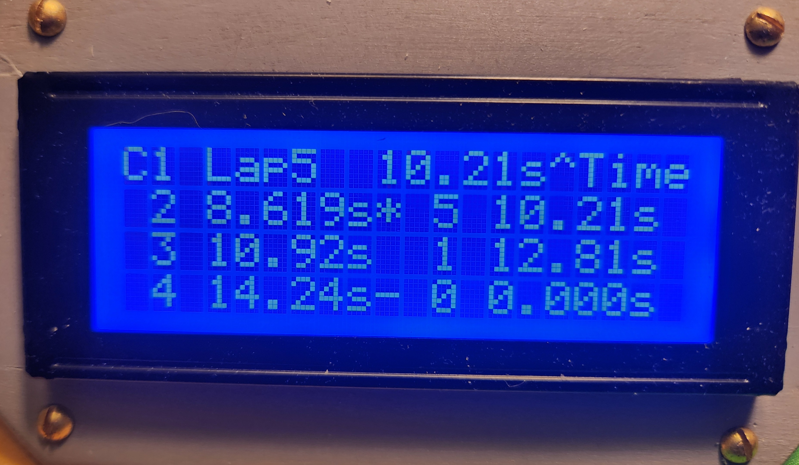This screen shows your fastest laps. Notice this racer has the fastest lap.</img>

### Race Control Lights

There is a RGB led flag light, that can emit different colors.
- **Red**: Your car should be stopped. Laps are not counted.
- **Yellow**: Your car should go at half speed through the lap sensor.
- **Green**: The race is on!
- **Cyan**: there is a winner.

### Display Screens 

During racing when your lap time is presented, on the right most column are punctuation is hint at your ongoing personal race status.

- ">" You are in the lead of the race.
- "<" You are no longer on the lead lap.
- "*" You just set the fastest lap of the race or qualifying session.
- "+" You just set your own PR for the race or qualifying session.
- "-" You just set your worst lap.
- "^" You currently hold the fastest lap. 

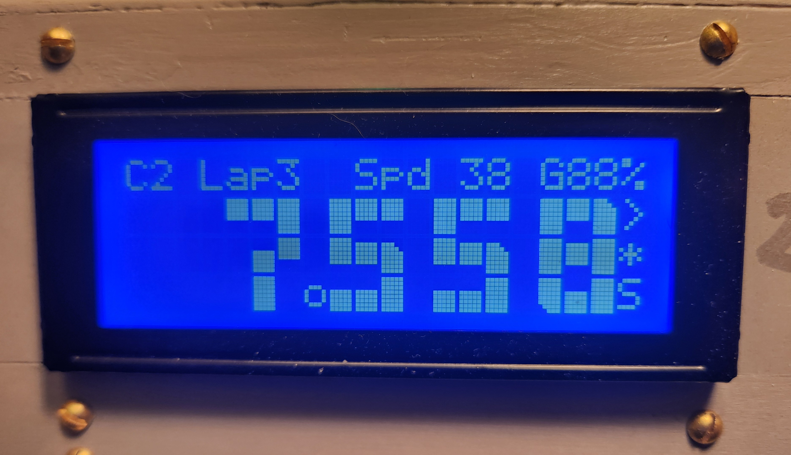This shows Car #2's lap time, crossed the start/finish at 38 inches per second, has 88% fuel, completed lap #3.  Currently leads the race and set fastest lap.</img>

## Stopping for fuel

Stop on the photo sensor to begin filling your tank.  There will be a progress bar and a sound. The longer the car sits, the more the tank is filled.
If your fuel gauge reads 0%, the lap will not be counted.
Fuel consumption is based on trap speed.
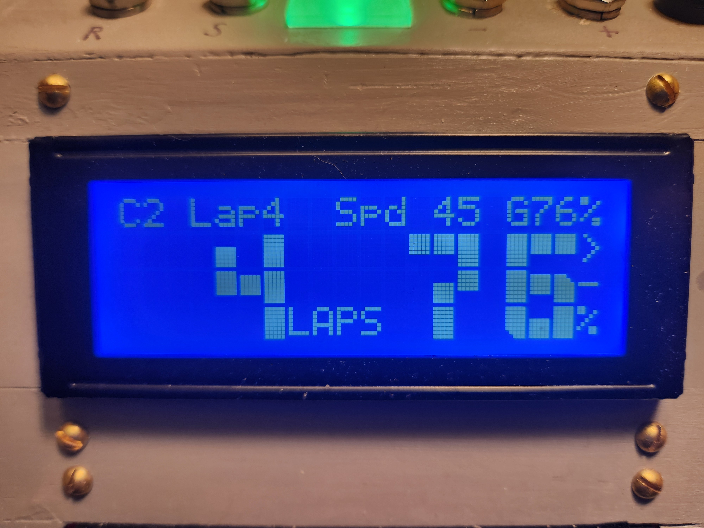Notice the G76% showing the tank level.</img>


## Lap Timing and Speed Calculation
- **Lap Duration**: Measured from start to start with time in milliseconds.
- **Trap Speed**: Calculated based on the time the car breaks the beam. The car length is assumed to be 2.5 inches, and this is internally calculated as a count of interrupt "clicks" and given in inches per second.
- **Reaction Time**: The time to take to cross the start line initially.  If during a road course, the start is jumped, the start won't be registered and the car must travel around to start the lap.

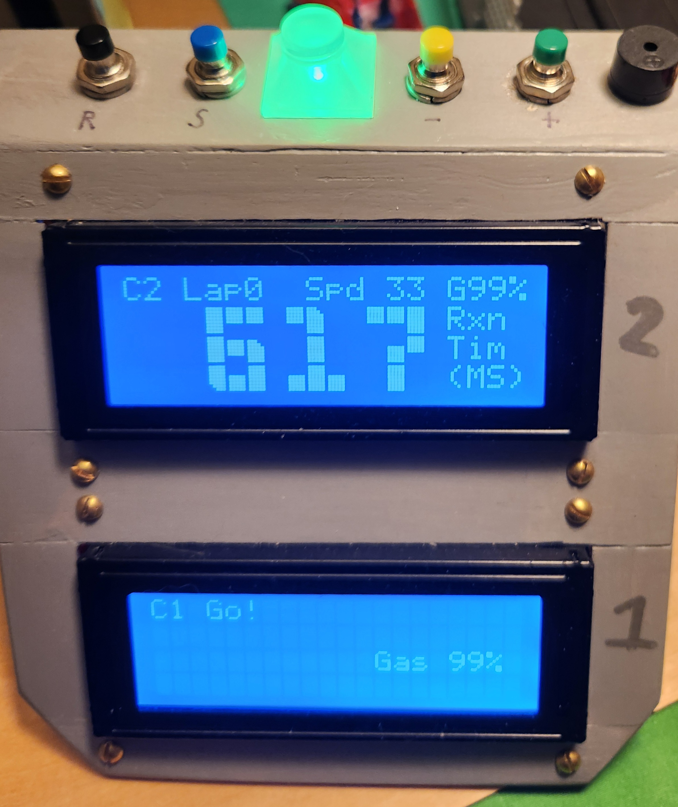</img>


**Inches per Second is the Best Speed Measurement for Slot Cars**

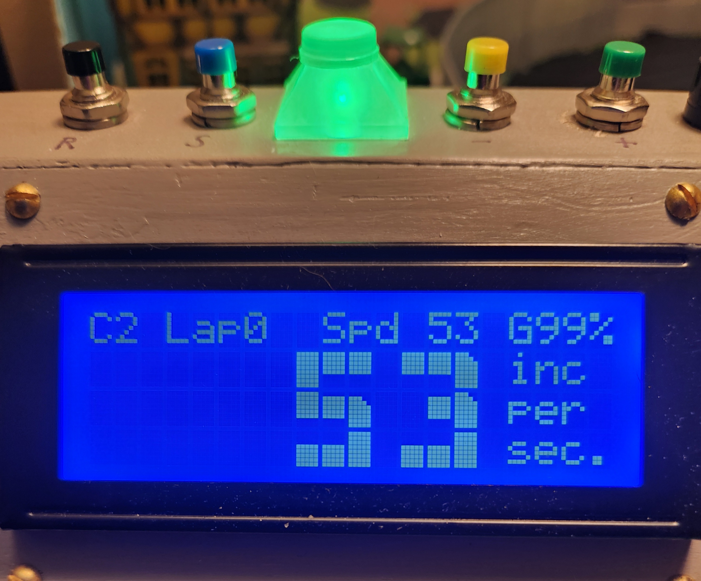</img>


Using inches per second (in/s) to measure slot car speed is practical and relatable. Here’s why:

1. **No Scale Confusion**: Avoids debates over different scale speeds.
2. **Real Car Comparison**: Similar to mph for real cars. For example, a fast slot car goes 8.5 feet per second, which is 5.8 mph or 102 inches per second. 102 sounds like a 1:1 car speed.
3. **Track Compatibility**: Our tracks (e.g. 6, 9, 18 inches) align perfectly with this measurement.
4. **Consistency**: Ensures uniformity across different tracks and setups.

By using inches per second, we simplify speed measurement and enhance our racing experience. 


## Real-Time Calculations
- **Average lap duration**: this is used to detect yellow or red flags
- **Average start/finish trap speed**: this is used to determine if a yellow flag speed limit violation occurs. Speed trap time is mostly resilient to outliers.
- **Impossibly fast laps** There is a debounce timeout that if the detection is within then the detection is completely ignored.
- **Automatic Jumped Lanes Detection** Doesn't rely on the average lap duration but instead uses the best lap duration for effectiveness. The track has a preset minimum lap time based on the fastest magnet car, which is configurable. This method is a baseline and somewhat protects the first lap. But for subsequent laps, especially for slower cars, a more accurate approach. After the first lap, if a car attempts to complete a lap too quickly based on the fastest lap time, that lap is rejected. This way, if a car jumps a lane and tries to record a lap time that's half of the overall best duration, the lap is discarded. Since the logic uses the best overall lap, only if all racers crash on the first lap will this system falsely reject laps.  The likelihood of the that is low.  If all racers crash on the first lap, it is recommended that the race is restarted.

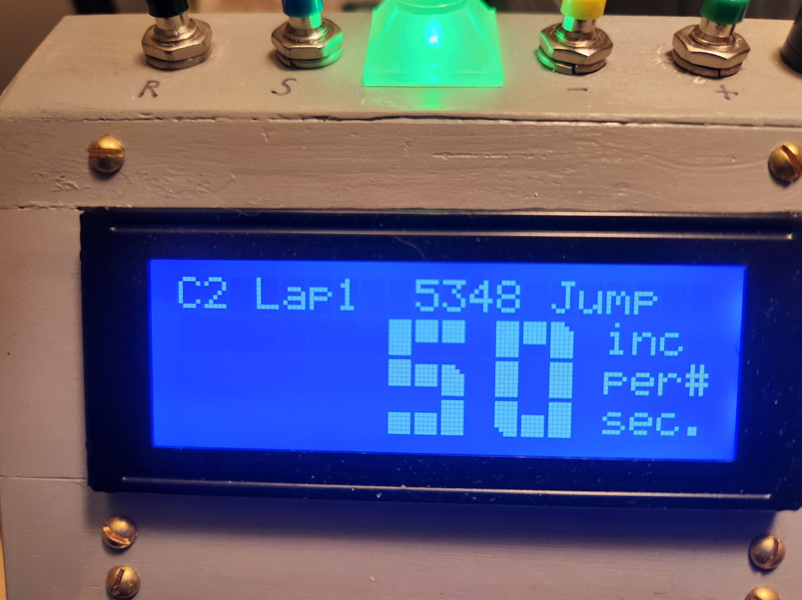The car triggered a lap very early and will not be counted.</img>

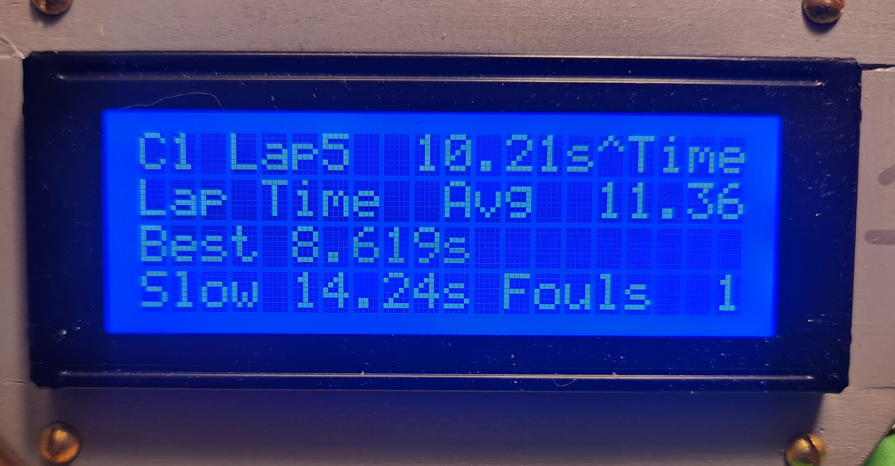This car is on lap 5, holds the fastest lap, but has one lap that did not count (fouls).</img>


*Car 0 on Lap 5 went through the photo eye at 10 inches per second and made a lap time of 3.280 seconds.*

## Automatic Yellow Flags
- If a driver hasn't completed a lap after a configurable amount of delay after their average lap time a yellow light goes on.
- Drivers must pass thru the sensor at a slower speed for the lap to count. Speeding the sensor results in that specific lap being ignored.

A competition yellow is thrown at a configurable interval through the race.

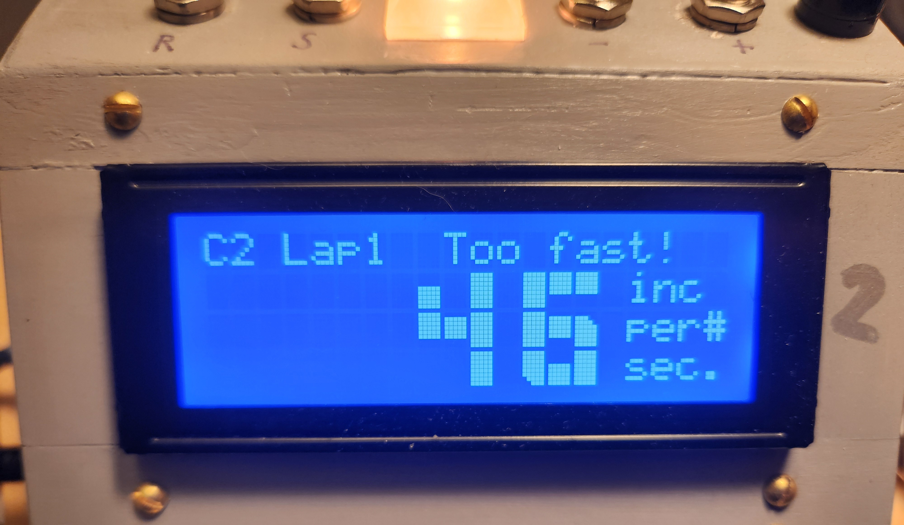If speeding through the yellow, this will be displayed and the lap will not be counted.</img>


## Automatic Red Flag

If a car is very late (configurable), the automated logic declares a red flag.

During red, no laps are counted. Best to stop and wait on the photo sensor, filling with fuel.  Wait for the red to clear and then proceed.


## Sounds
- **Single Tone**: Lap counted.
- **Falling tone**: Lap ignored/deleted.
- **Green flag**: starting beeps.
- **Winner**: Ode to Joy.
- **Lost**: “engine“ sounds
- *Quick high pitch tone*: Fastest lap recorded
- March snippets: fast temp yellow, slow tempo red flag.

# Car Sensing 

When using a photoresistor to detect a slot car, a single threshold is typically set to trigger the sensor when the reading drops below this threshold (e.g., `if reading < threshold`). A debounce mechanism is also used to prevent multiple triggers from a single event.

However, this method loses a lot of information. By using two thresholds, you can analyze the duration of the car passing over the sensor. Here's how it works:

1. **Initial Threshold**: When the reading drops below this threshold, start counting the readings.
2. **Main Threshold**: When the reading drops below this threshold, it confirms a real trigger (the car is detected).
3. **End of Trigger**: When the reading rises above the initial threshold again, it confirms the car has left the sensor.

This approach allows you to measure the duration of the trigger event, providing more detailed information about the car's passage.

This software calculates speed in inches per second by this equation: `speed = AVG_CAR_LEN_INCHES * MS_TO_SEC * readingsPerMs / detectionCount`

Here is the logic on pseudo code:
```
//Readings are done many times per millisecond 
If reading < initial_threshold then
  If count<65535 then
     count++;
  Endif
 If reading<main_threshold then 
  qualified=true;
 Endif
Endif
If reading>=initial_threshold then
 If qualified then 
   If currentTime > lastTriggerTime + debounceInterval then
    calculate inches per second based on count
    lapDuration = currentTime - lastTriggerTime
    lastTriggerTime=currentTime
 Endif
 qualified=false
 count=0
Endif
```

# Hardware 

## Light Sensors 

This project should be able to work with either LDRs or photo diodes.

*Photoresistors* (LDRs) and *photodiodes* are both light-sensitive components, but they operate differently. A photoresistor changes its resistance based on the intensity of light; as light increases, its resistance decreases, making it useful for simple light-sensing applications. LDRs are relatively slow to fully change resistance. In contrast, a photodiode generates a current or voltage when exposed to light, offering higher sensitivity and faster response times. 

There are also photo transistors to consider but this code isn't designed for it.

The code and wiring has been tested with photodiodes and photo resistors and they both work. Polarity matters with diodes, so if it isn't working swap the polarity. With drag racing photo resistors may be too slow and photodiodes would be favorable. Photodiodes are smaller and are easier to install in the track. The calculation of car speed does seem to be affected by the choice of sensor.

Perhaps, if you have strobing lights (cheaper LED or florescent bulbs) photo diodes speed could be an issue and false trigger due to the AC current induced strobing? So the slower LDR could be an advantage? (I confirmed that indeed photodiodes are sensitive to AC lighting flickering/strobing and a battery supplied light is better if photodiodes are used. The symptom of this is the trap speed calculation can be overly quick.) Photodiodes can also be sensitive to capacitance if long pairs of wires are used, to remedy this, pull the pair of wires apart.

Examples of 
- uxcell 20pcs Photosensitive Diode Photodiodes Light Sensitive Sensors,3mm Clear Flat Head Receiver Diode
- Chanzon 5mm 0.2 Ω ohm Photoresistor LDR Resistor 5506 GL5506 Light-Dependent Photoconductor 20pcs Photo Light Sensitive


Photodiode Specification:
Receive Wave Range : 400-1100 nm
Response Peak Wavelength：940 nm
Receiving Angle : 40°
Material：Si, Plastic, Metal
Head Color : Clear
Head Size : 3 x 4mm / 0.12 x 0.16 inch (D*H)
Pin Dia : 0.4 mm / 0.016 inch
Total Length: 33mm / 1.3 inch

Package Type: DIP(Dual In-line Package)
Polarity: Anode (Longer Part) | Cathode (Shorter Part)

LDR specifications:
Model: GL 5506
Light Resistance: 5 – 10 Kilo Ohms
Dark Resistance: 0.5 Mega Ohms
Max Voltage: 150 V
Max Power Consumption: 90 mW
Spectral Peak: 540 nm
Response Time Up: 30 ms
Response Time Down: 30 ms
Operating Temperature: -30⁰C ~ +70⁰C
Dimensions: 4.3mm x 5.1mm x 2.1 mm


Example of installed photo sensor in the track. This was glued with JBWeld, but a better option is super glue. Note the two red dots, by installing the sensors there, the drill bit will self align and be perfect across the track. The wires used are the ones with an Arduino kit. No soldering required.


# Wiring

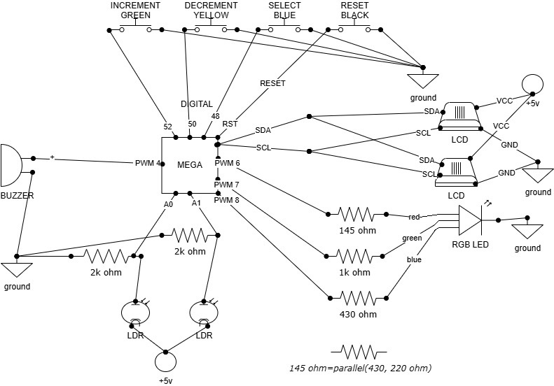
In the above chart, photodiodes can replace the LDR's but keep in mind that polarity matters. Photodiodes must be installed with reverse bias. As for the RGB LED, there are 4 leads: a ground, red, green, and blue. Please see the next image for complete details. The 2k resistors can be higher ohms for increased photosensitivity.

There are relatively few connections and many grounds and +5v pins to choose from on an Arduino mega. So a wiring loom is a possibility.

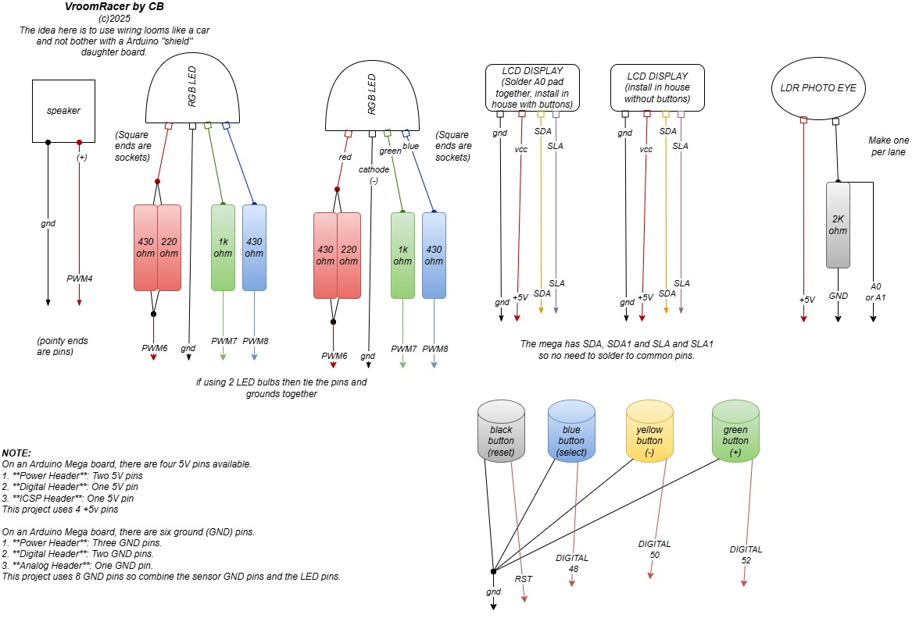

Note: the parallel resistor in the above diagram can be replaced with a single resistor of about 145 ohm.

# Enclosure

I built mine out of thin hobby plywood that can be cut with a utility knife. To ease assembly , taping the exterior together then gluing from the inside using toothpick joiners with quick set white glue is very effective. For the exterior, I printed "textures" on my ink jet printer. For the roof, I am using cardstock paper.

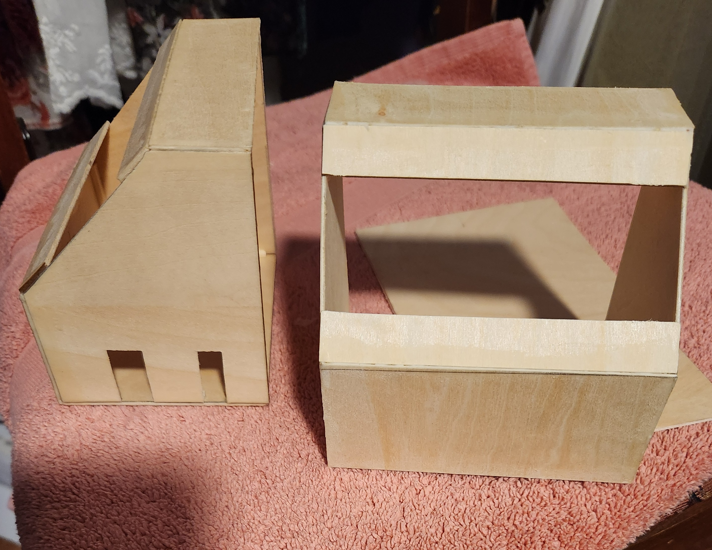


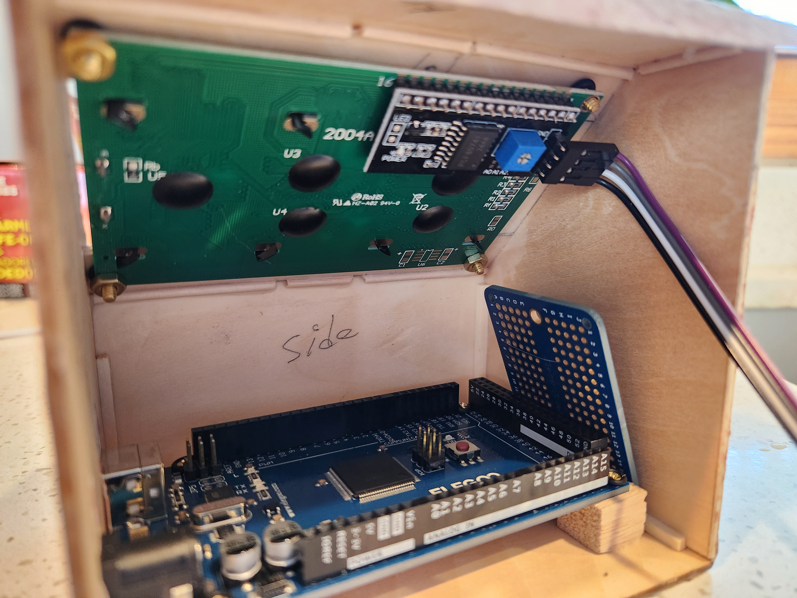

# ERD

<div style="background-color: white; padding: 5px; display: inline-block;">
  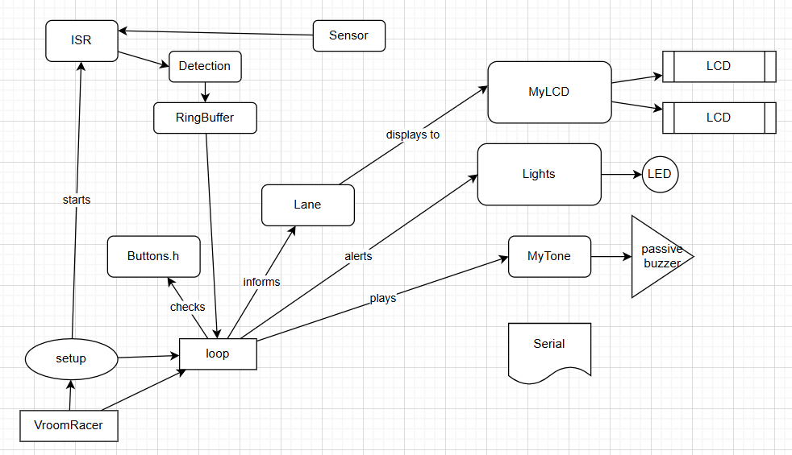
</div>

# About voltage dividers

I have made 3 devices so far. First two being road course timers which work perfectly. The third one is a drag strip timer and have been having some issues tuning it.

Using a **photodiode in reverse bias** within a **voltage divider** setup on an Arduino is a great way to measure light intensity with improved sensitivity and faster response times. Here’s how it works:

### **Understanding Reverse Bias Photodiodes**
- In **reverse bias mode**, the cathode (negative) is connected to a higher voltage, and the anode (positive) to a lower voltage (typically ground).
- The diode does **not conduct** like a regular diode unless light strikes it, generating a **small photocurrent** proportional to the light intensity.
- This configuration **reduces capacitance**, making the response faster.

---

### **Setting Up the Voltage Divider**
A **voltage divider** transforms the photocurrent into a voltage signal that the Arduino can read. Here's a basic setup:

1. **Connect the Photodiode in Reverse Bias**:
   - **Cathode** → **VCC (e.g., 5V or 3.3V)**
   - **Anode** → **One end of the resistor**
   - The other end of the resistor → **Ground**
   - The junction between the **photodiode and resistor** becomes the output voltage.

2. **Selecting the Resistor Value**:
   - Use a **pull-down resistor** (e.g., **10kΩ to 1MΩ**).  
   - Higher resistance **increases sensitivity** to low-light conditions but may slow response time.
   - Lower resistance **improves response speed** but may reduce sensitivity.

3. **Reading the Voltage with Arduino**:
   - Connect the voltage junction (between the **photodiode and resistor**) to an **analog pin (A0, A1, etc.)**.
   - Use `analogRead(pin)` to measure the voltage, which **varies based on light intensity**.

---

### **Arduino Code Example**
```cpp
const int sensorPin = A0; // Photodiode voltage divider junction
void setup() {
    Serial.begin(9600);
}
void loop() {
    int sensorValue = analogRead(sensorPin); // Read voltage level
    float voltage = sensorValue * (5.0 / 1023.0); // Convert ADC value to volts
    Serial.println(voltage); // Print voltage to monitor
    delay(500);
}
```
This setup allows you to track changes in light levels and adjust the resistor value for better sensitivity.


